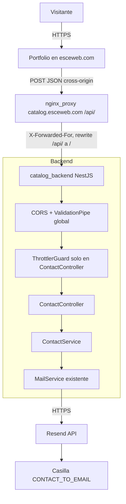
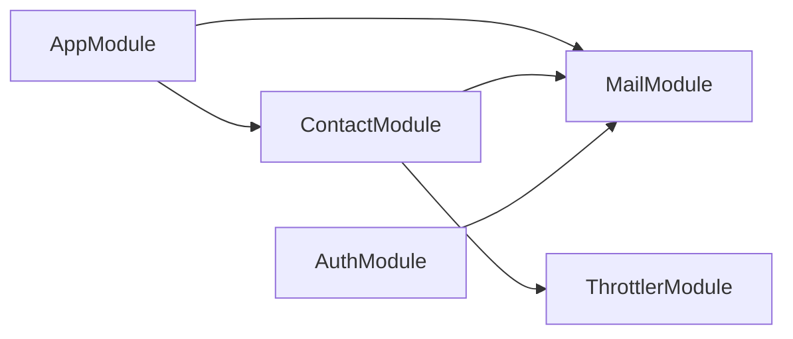
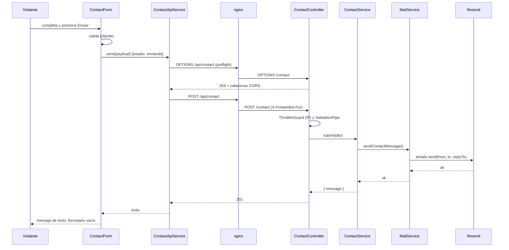
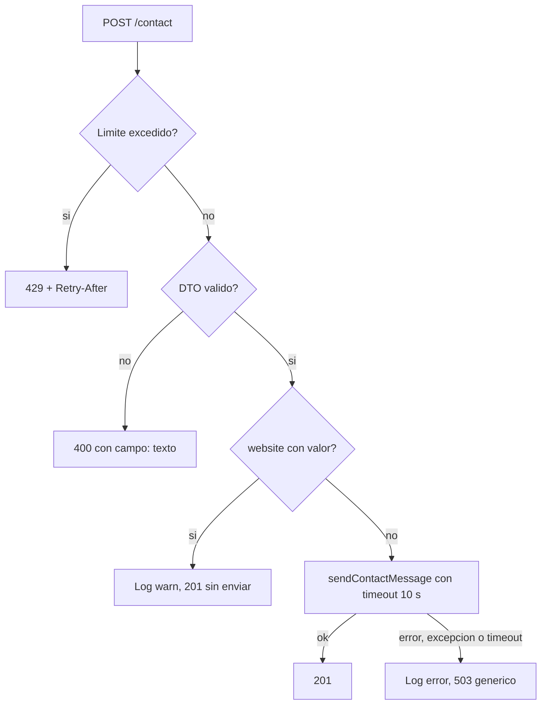

# Diseño: contact-form

## Resumen y decisiones clave

El portfolio (`esceweb.com`) envía el formulario con `POST https://catalog.esceweb.com/api/contact`. En el backend de `mi-catalogo-online` se agrega un módulo `contact` independiente de `auth` y `users`, que valida el DTO, aplica honeypot y límite de frecuencia por IP, y envía el mail reutilizando el cliente Resend que ya tiene `MailService`.

Decisiones principales:

1. **Módulo en el backend existente, no microservicio** (ver comparación más abajo). Es la recomendación final, con un riesgo real y documentado: el formulario deja de funcionar mientras `catalog_backend` se redespliega (hasta ~90 s).
2. **Tres repos cambian.** `web-stack` es parte del trabajo: sin `CORS_ORIGIN` ampliado y sin las variables nuevas pasadas al contenedor, nada funciona en producción.
3. **`trust proxy` es obligatorio** para que el límite por IP funcione detrás de nginx. Es el único cambio que toca el comportamiento global del backend.

## Verificación contra el código (qué se confirmó y qué no)

| Dato | Estado | Fuente |
|---|---|---|
| NestJS 11.1.6, Resend SDK 6.12.0, Node 22 | Verificado | `backend/package.json`, `node_modules/*/package.json`, Dockerfile |
| `CreateEmailOptions` acepta `replyTo` | Verificado | `node_modules/resend/dist/index.d.mts:550` |
| `@nestjs/throttler` 6.7.1 es compatible con Nest 11 | Verificado en el registro de npm (peer `^11.0.0`); **no está instalado** | `npm view` |
| El SDK de Resend no ofrece timeout propio | No encontré opción de timeout en los tipos; se implementa con `Promise.race` | tipos de `resend` |
| El nginx agrega la IP real a `X-Forwarded-For` | Verificado | `web-stack/nginx/default.conf` (`$proxy_add_x_forwarded_for`) |
| Un solo proxy entre el cliente y el backend | Verificado en el repo; **si en el futuro se agrega un CDN o balanceador habrá que cambiar el número de saltos** | `web-stack/docker-compose.yml` |
| El deploy automático solo cambia `*_TAG` | Verificado: **no aplica cambios al compose ni al `.env`** | `web-stack/deploy/deploy.sh` |
| `MAIL_FROM` verificado en Resend | Confirmado por el usuario, no verificable desde el código | — |
| El portfolio no tiene `environments`, `HttpClient` ni formularios | Verificado | `portfolio/src`, `app.config.ts` |

## Comparación: módulo vs. microservicio

| Criterio | Módulo `contact` en el backend | Microservicio aparte |
|---|---|---|
| Trabajo de implementación | Un módulo + un método en `MailService`. | Repo o carpeta nueva, Dockerfile, CI, imagen en GHCR, servicio en compose, bloque nginx y entrada en `deploy.sh` y en el `command=` de `authorized_keys`. |
| Infraestructura | Cero contenedores nuevos. | +1 contenedor (otros usan `mem_limit` de 64 MB a 384 MB) y +1 secreto de deploy. |
| Resend | Reutiliza `MailService` y las variables existentes. | Duplica la integración y `RESEND_API_KEY`. |
| Aislamiento de fallos | Comparte proceso con auth y carrito. Mitigado: el módulo captura sus errores y no toca la base de datos. | Aislado: un fallo del formulario no afecta al catálogo. |
| Disponibilidad del formulario | **Depende de `catalog_backend`**. En cada deploy del backend se hace `pg_dump`, se recrea el contenedor y se corren migraciones: el `start_period` del healthcheck es de 90 s. Durante ese lapso el formulario devuelve error. | Independiente del catálogo. |
| Acoplamiento de dominio | El portfolio llama a la API de `catalog.esceweb.com`. Nombre poco intuitivo pero funcional. | Dominio propio posible (`api.esceweb.com`). |
| Falla al arrancar | Un `CONTACT_TO_EMAIL` ausente **impide arrancar el backend entero** (REQ-9.2). El deploy hace rollback automático al tag anterior si no queda `healthy`. | Un error de config solo afecta al formulario. |
| Rate limiting en memoria | Se reinicia con cada deploy; un solo contenedor, así que no hay inconsistencia entre réplicas. | Igual. |

**Recomendación final: módulo en el backend existente.** Es proporcional al caso (formulario de portfolio, un solo operador, tráfico bajo, Resend ya integrado) y evita sumar un servicio completo al pipeline de deploy.

**Riesgos aceptados:**

1. El formulario no responde mientras se redespliega `catalog_backend`. Mitigación: el mensaje de error del formulario muestra el email de contacto (REQ-4.7).
2. Un error en la configuración nueva puede impedir el arranque del backend. Mitigación: orden de despliegue y rollback automático descritos en el plan de despliegue.
3. El límite por IP se reinicia en cada deploy y es por contenedor.

**Cuándo revisarlo:** si otro sitio necesita el mismo formulario, si el tráfico crece, o si la indisponibilidad durante los deploys deja de ser aceptable. Migrar a un servicio aparte sería fácil: el módulo no depende de `auth` ni de la base de datos (NFR-4).

## Arquitectura



Frontera de módulos del backend:



`ContactModule` solo depende de `MailModule` y `ThrottlerModule`: no importa `auth`, `users` ni entidades (NFR-4).

## Componentes e interfaces

### Backend — `ContactModule` (`backend/src/contact/`)

Imports **relativos** en todo el código nuevo (NFR-5).

```
backend/src/contact/
├─ contact.module.ts
├─ contact.controller.ts
├─ contact.service.ts
├─ dto/create-contact.dto.ts
├─ contact.controller.spec.ts
├─ contact.service.spec.ts
├─ create-contact.dto.spec.ts
└─ contact.integration.spec.ts
```

#### `CreateContactDto`
- **Responsabilidad:** validar y normalizar la entrada.
- **Cubre:** REQ-2, REQ-5.
- **Interfaz:**
  ```ts
  export class CreateContactDto {
    @Transform(trim) @IsString @MinLength(2) @MaxLength(80)   name: string;
    @Transform(trim) @IsEmail @MaxLength(254)                 email: string;
    @Transform(trim) @IsString @MinLength(10) @MaxLength(2000) message: string;
    @IsOptional()                                              website?: unknown; // honeypot
  }
  ```
- **Mensajes de error:** cada decorador usa `message` en castellano con el formato `"<campo>: <texto>"` (ej. `"name: El nombre debe tener entre 2 y 80 caracteres"`). Así el cliente puede asignar cada error a su campo sin depender del texto en inglés de `class-validator` (REQ-2.5, REQ-4.5).
- `website` no lleva validación de tipo ni de largo, para que cualquier valor del honeypot llegue al servicio y reciba el 201 silencioso (REQ-5.2). Está declarado para que `forbidNonWhitelisted` no lo rechace (REQ-2.4).
- Los campos desconocidos siguen produciendo 400 por el pipe global, sin cambios en `main.ts`.

#### `ContactController`
- **Responsabilidad:** exponer `POST /contact`, aplicar el límite de frecuencia y delegar.
- **Cubre:** REQ-1.5, REQ-6, REQ-11.1.
- **Interfaz:**
  ```ts
  @ApiTags('contact')
  @Controller('contact')
  @UseGuards(ThrottlerGuard)          // solo este controller; nunca APP_GUARD
  export class ContactController {
    @Post()                           // 201 por defecto
    async create(@Body() dto: CreateContactDto): Promise<{ message: string }>;
  }
  ```
- El límite se declara con la configuración del `ThrottlerModule` del propio módulo (valores del entorno), no con constantes en el decorador.

#### `ContactService`
- **Responsabilidad:** decidir qué hacer con la solicitud (honeypot, envío, timeout, mapeo de errores).
- **Cubre:** REQ-1.1–1.3, REQ-5.2–5.4, REQ-8, REQ-9.1–9.2.
- **Interfaz:**
  ```ts
  @Injectable()
  export class ContactService {
    constructor(config: ConfigService, mail: MailService); // lanza Error si CONTACT_TO_EMAIL falta o no es email
    async submit(dto: CreateContactDto): Promise<{ message: string }>;
  }
  ```
- **Comportamiento de `submit`:**
  1. Si `dto.website` es truthy: `Logger.warn('Honeypot activado')` sin contenido, y devuelve el mismo cuerpo de éxito. No invoca a Resend.
  2. Si no: llama a `mail.sendContactMessage(...)` dentro de `Promise.race` con un temporizador de 10 s.
  3. Cualquier error, ya sea de Resend, excepción o timeout, se registra con `Logger.error` (solo el error, sin el mensaje del visitante) y se lanza `ServiceUnavailableException` con un texto genérico fijo.
- **Validación de `CONTACT_TO_EMAIL`:** en el constructor, con `isEmail` de `class-validator`. El mensaje del `Error` nombra la variable.

#### `MailService.sendContactMessage` (cambio aditivo en archivo existente)
- **Responsabilidad:** componer y enviar el mail. Mantiene la integración con Resend en un único lugar.
- **Cubre:** REQ-1.2–1.4, REQ-1.6–1.8.
- **Interfaz:**
  ```ts
  async sendContactMessage(input: {
    to: string; name: string; email: string; message: string;
  }): Promise<void>; // lanza si Resend devuelve { error }
  ```
- **Contenido del mail:**
  - `from`: `MAIL_FROM` (ya cargado en el constructor).
  - `replyTo`: el email del visitante.
  - `subject`: `"Contacto portfolio: " + nombre con espacios y saltos de línea colapsados a un solo espacio`.
  - `html`: nombre, email y mensaje con `&`, `<`, `>`, `"` y `'` escapados; los saltos de línea del mensaje se convierten en `<br>`.
  - `text`: versión en texto plano.
- Los métodos existentes (`sendVerificationEmail`, `sendResetPasswordMail`) **no se modifican**. El `MailService` ya exporta desde `MailModule`.

#### `ContactModule`
- **Cubre:** REQ-6, REQ-9.4, REQ-11.
- **Configuración del límite:**
  ```ts
  ThrottlerModule.forRootAsync({
    inject: [ConfigService],
    useFactory: (c: ConfigService) => ({
      throttlers: [{
        ttl: Number(c.get('CONTACT_RATE_TTL_SECONDS') ?? 600) * 1000,
        limit: Number(c.get('CONTACT_RATE_LIMIT') ?? 3),
      }],
      errorMessage: 'Demasiados intentos. Probá de nuevo más tarde.',
    }),
  })
  ```
  En `@nestjs/throttler` v6 el `ttl` va en milisegundos. El guard se aplica solo con `@UseGuards` en el controller, por lo que ningún otro endpoint queda limitado (REQ-6.5). `ThrottlerGuard` responde 429 y agrega `Retry-After` (REQ-6.2): confirmado en el código instalado (`throttler.guard.js`, `setHeaders` por defecto) y en `contact.integration.spec.ts`.
- **Almacenamiento:** el de memoria por defecto. Adecuado para un solo contenedor (riesgo aceptado).

#### Cambios en `main.ts` y `env.model.ts`
- `main.ts`: una línea, `app.getHttpAdapter().getInstance().set('trust proxy', 1)`, antes de `listen`. Con un salto de confianza, Express toma como IP del cliente la última entrada de `X-Forwarded-For`, que es la que agregó nuestro nginx; cualquier valor que el cliente haya inyectado antes queda ignorado. **Cubre REQ-6.3.**
- `Env`: se agregan `CONTACT_TO_EMAIL`, `CONTACT_RATE_LIMIT` y `CONTACT_RATE_TTL_SECONDS` (REQ-9.5).
- CORS no requiere código: `enableCors` ya acepta una lista separada por comas en `CORS_ORIGIN`. El cambio es solo de configuración (REQ-7).

### Portfolio — formulario (`portfolio/src/app/`)

```
portfolio/src/app/
├─ app.config.ts                     (+ provideHttpClient(withFetch()), + token API_BASE_URL)
├─ core/api-base-url.token.ts        InjectionToken<string>
├─ page/contact/
│   ├─ contact-api.service.ts        envío HTTP y mapeo de errores
│   ├─ contact-form.ts               componente (selector app-contact-form)
│   ├─ contact-form.html
│   ├─ contact-api.service.spec.ts
│   └─ contact-form.spec.ts
└─ page/landing/landing.html|ts      reemplaza el bloque de contacto
src/environments/environment.ts            apiBaseUrl de desarrollo
src/environments/environment.prod.ts       https://catalog.esceweb.com/api
angular.json                               fileReplacements en la configuración production
```

Se sigue la estructura del repo (`page/<nombre>/`) y los nombres sin sufijo (`landing.ts`, `landing.html`).

#### `API_BASE_URL` y entornos
- **Cubre:** REQ-10.
- `environment.ts` apunta a `http://localhost:3000` y `environment.prod.ts` a `https://catalog.esceweb.com/api`. `angular.json` reemplaza el primero por el segundo en `production`, que es la configuración por defecto del build.
- `app.config.ts` provee `API_BASE_URL` con `environment.apiBaseUrl`. El servicio la inyecta; ningún componente tiene la URL escrita.

#### `ContactApiService`
- **Responsabilidad:** `POST` al backend y traducción del error HTTP a un tipo propio.
- **Cubre:** REQ-1.1, REQ-4.4–4.9, REQ-10.3.
- **Interfaz:**
  ```ts
  export interface ContactPayload { name: string; email: string; message: string; website: string; }

  export type ContactError =
    | { kind: 'validation'; fields: Partial<Record<'name' | 'email' | 'message', string>>; general?: string }
    | { kind: 'rate-limit' }
    | { kind: 'server' }      // 5xx
    | { kind: 'network' }     // status 0
    | { kind: 'timeout' };    // 15 s

  send(payload: ContactPayload): Observable<void>; // error del observable = ContactError
  ```
- Usa `timeout(15000)` de RxJS (REQ-4.9). Al vencer, la suscripción cancela la petición.
- Mapeo del 400: toma `message: string[]` y asigna cada texto `"campo: texto"` al campo; lo que no tenga ese formato (por ejemplo `property x should not exist`) va a `general` (REQ-4.5, REQ-4.6).

#### `ContactForm` (componente)
- **Responsabilidad:** formulario reactivo, estados y accesibilidad.
- **Cubre:** REQ-3, REQ-4, REQ-5.1, REQ-11.4–11.5, NFR-2, NFR-3, NFR-6.
- **Estado:** `status = signal<'idle' | 'sending' | 'success' | 'error'>('idle')` y `error = signal<ContactError | null>(null)`. Es Standalone, `OnPush`, con Reactive Forms (Signal Forms requieren Angular 21).
- **Controles:** `name`, `email`, `message` y `website` (honeypot).
- **Validadores en cliente** (espejo de REQ-2): `required`, `minLength`/`maxLength` sobre el valor sin espacios en los extremos, y `email`. El servidor sigue siendo la autoridad.
- **Mensajes de error** en castellano, bajo cada campo, visibles tras `blur` o intento de envío (REQ-3.1). Cada campo inválido lleva `aria-invalid="true"` y `aria-describedby` apuntando a su mensaje (REQ-3.6).
- **Envío:** `markAllAsTouched()`; si es inválido, no se llama al servicio y el foco va al primer `[aria-invalid="true"]` (REQ-3.2, REQ-3.3). Si es válido: `status = 'sending'`, botón deshabilitado con el texto "Enviando…" (REQ-4.1, REQ-4.2).
- **Resultado:**
  - 201: mensaje de éxito y `form.reset()` (REQ-4.3).
  - `rate-limit`: texto de demasiados intentos (REQ-4.4).
  - `validation`: errores por campo con `setErrors({ server: texto })`, o mensaje general (REQ-4.5, REQ-4.6).
  - `server` / `network` / `timeout`: mensaje general **con el email `esce.arguello21@gmail.com`** como alternativa; se conserva lo escrito (REQ-4.7, REQ-4.9).
- **Región viva:** un contenedor con `aria-live="polite"` para el éxito y `role="alert"` para los errores de envío (REQ-4.8).
- **Honeypot:** un `<input>` con `name="website"` fuera de pantalla (`position:absolute; left:-9999px`), `tabindex="-1"`, `aria-hidden="true"`, `autocomplete="off"` y sin etiqueta visible. Se envía siempre (vacío para humanos) (REQ-5.1).
- **Contador:** `charCount` derivado con `computed` desde `valueChanges` (`toSignal`), mostrado como `n / 2000` (REQ-3.7).
- **Estilo:** clases de DaisyUI 5 y Tailwind ya presentes (`input`, `textarea`, `btn btn-primary`), de modo que respeta los temas `business` y `corporate` (NFR-6). Layout de una columna con `w-full` y `max-w-*` para evitar desbordamiento a 320 px (NFR-3).
- El email **no se muestra** en los estados `idle`, `sending` ni `success` (REQ-4.11).

#### Cambios en `landing`
- **Cubre:** REQ-11.3–11.4.
- En `landing.html`, dentro de `<section id="contact">`, se mantienen la sección, el `id` y el título "Contactame". El bloque con el email y el botón "Copiar" se reemplaza por `<app-contact-form>`.
- Se importa `ContactForm` en `landing.ts`.
- **Limpieza asociada:** el botón "Copiar" era lo único que usaba `copyEmail`, `isCopying`, `isEmailCopied`, `showCopyToast`, `copyFeedbackTimeout`, los íconos `faCopy` y `faCheck`, y el toast del encabezado de `landing.html` (línea 3). Al quitar el botón quedan sin uso; se eliminan para no dejar código muerto. Se confirma con una búsqueda antes de borrar, ya que el resto de la landing queda intacto. La constante `email` se conserva solo si el formulario la necesita; se le pasa como `input()` al componente.

### web-stack

- **Cubre:** REQ-7.4, REQ-9.5–9.6.
- `docker-compose.yml`, servicio `catalog_backend`:
  - `CORS_ORIGIN: https://catalog.esceweb.com,https://esceweb.com,https://www.esceweb.com`
  - `CONTACT_TO_EMAIL: ${CONTACT_TO_EMAIL:?CONTACT_TO_EMAIL is required}`
  - `CONTACT_RATE_LIMIT: ${CONTACT_RATE_LIMIT:-3}`
  - `CONTACT_RATE_TTL_SECONDS: ${CONTACT_RATE_TTL_SECONDS:-600}`
- `.env.example`: se agrega `CONTACT_TO_EMAIL=` (sección catalog) y las dos variables de límite como opcionales.
- `nginx/default.conf`: **sin cambios.** El tráfico es cross-origin hacia `catalog.esceweb.com/api/`, que ya existe, y el nginx deja pasar el preflight `OPTIONS` hacia el backend.

## Modelo de datos

No hay persistencia: ninguna entidad, tabla ni migración. El mensaje solo vive en memoria durante la solicitud y en el mail.

## Contrato del endpoint

`POST https://catalog.esceweb.com/api/contact` (en el backend: `POST /contact`). Sin autenticación. `Content-Type: application/json`.

**Solicitud**
```json
{ "name": "Ana Pérez", "email": "ana@ejemplo.com", "message": "Hola, me gustaría...", "website": "" }
```

| Código | Cuándo | Cuerpo |
|---|---|---|
| 201 | Enviado, o honeypot activado | `{ "message": "Mensaje enviado correctamente." }` (idéntico en ambos casos) |
| 400 | DTO inválido o campo no permitido | `{ "statusCode": 400, "message": ["name: ...", "email: ..."], "error": "Bad Request" }` |
| 429 | Límite excedido | `{ "statusCode": 429, "message": "Demasiados intentos..." }` + cabecera `Retry-After` |
| 503 | Resend falla, lanza o supera 10 s | `{ "statusCode": 503, "message": "No pudimos enviar tu mensaje. Intentá de nuevo más tarde.", "error": "Service Unavailable" }` |

CORS: orígenes permitidos `https://esceweb.com`, `https://www.esceweb.com` y `https://catalog.esceweb.com`; el navegador hace preflight `OPTIONS` por usar `application/json`.

## Flujos principales

### Envío exitoso



### Honeypot, límite y falla de Resend



## Manejo de errores

| Situación | Backend | Cliente |
|---|---|---|
| Campos inválidos | 400 con `campo: texto`; Resend no se invoca | Error bajo el campo o mensaje general |
| Campo no declarado | 400 (pipe global) | Mensaje general |
| Límite excedido | 429 + `Retry-After`; Resend no se invoca | Mensaje de demasiados intentos |
| Honeypot | 201 idéntico; `warn` sin contenido | Éxito (el bot no distingue) |
| Resend `{ error }`, excepción o timeout de 10 s | 503 genérico; `error` en el log sin el mensaje del visitante | Mensaje general con el email alternativo |
| Sin red / CORS bloqueado / 15 s sin respuesta | — | Mismo mensaje general con el email alternativo |
| `CONTACT_TO_EMAIL` ausente o inválido | El backend no arranca; el deploy hace rollback al tag anterior | — |
| `RESEND_API_KEY` ausente | Igual que hoy: el backend no arranca | — |

Nunca se devuelve al cliente el error de Resend, trazas, claves ni direcciones (REQ-8.3).

## Estrategia de testing

### Backend (Jest; los tests nuevos usan imports relativos y no dependen de los specs rotos)

| Archivo | Tipo | Cubre |
|---|---|---|
| `contact.service.spec.ts` | Unitario, `MailService` mockeado | Envío correcto (REQ-1.2); `{ error }` de Resend, excepción y timeout con temporizadores simulados → 503 (REQ-8.1, 8.2, 8.5); honeypot sin invocar al mail (REQ-5.2, 5.3); `CONTACT_TO_EMAIL` ausente o inválido (REQ-9.2) |
| `mail-contact.spec.ts` | Unitario, `resend` y `ConfigService` mockeados | `from`, `replyTo`, asunto sin saltos de línea y HTML escapado (REQ-1.3, 1.4, 1.7, 1.8) |
| `create-contact.dto.spec.ts` | Unitario, `ValidationPipe` con las opciones de `main.ts` | Límites de nombre, email y mensaje; recorte de espacios; campo desconocido; formato `campo: texto` (REQ-2.1–2.5) |
| `contact.controller.spec.ts` | Unitario, servicio mockeado | Delegación y cuerpo 201 (REQ-1.5); 503 propagado (REQ-8) |
| `contact.integration.spec.ts` | Integración con `supertest` y el servicio de mail sobrescrito | 429 en la solicitud 4 con la cabecera `Retry-After` y sin invocar al mail (REQ-6.1, 6.2, 6.4); IP tomada de `X-Forwarded-For` con `trust proxy` (REQ-6.3); CORS permitido/denegado (REQ-7.1–7.3); un endpoint existente no queda limitado (REQ-6.5) |

Limitación conocida: el test de integración replica la configuración de `main.ts` (pipe, CORS, `trust proxy`) porque `main.ts` no es importable. La verificación real de REQ-6.3 y REQ-7 contra el nginx de producción es manual (ver `tasks.md`).

### Portfolio (Karma + Jasmine, `ChromeHeadless`; el CI bloquea si fallan)

| Archivo | Cubre |
|---|---|
| `contact-api.service.spec.ts` (con `HttpTestingController`) | URL desde `API_BASE_URL` (REQ-10.3); mapeo de 400/429/5xx/status 0; timeout de 15 s con `fakeAsync` (REQ-4.9) |
| `contact-form.spec.ts` | Validación y foco en el primer inválido (REQ-3.1–3.4); `aria-invalid` y etiquetas (REQ-3.5, 3.6); contador (REQ-3.7); estado "enviando" con botón deshabilitado (REQ-4.1, 4.2); éxito y reset (REQ-4.3); 429, 400 con campos, 5xx con email alternativo y valores conservados (REQ-4.4–4.7); honeypot presente y oculto (REQ-5.1); el email no aparece en el estado inicial (REQ-4.11) |
| `landing.spec.ts` (ya existe) | Sigue pasando; se ajusta si el componente necesita `provideHttpClient` |

### Verificación manual en producción (después de desplegar)
`curl` contra `https://catalog.esceweb.com/api/contact` con `Origin: https://esceweb.com` (cabeceras CORS), cuatro envíos seguidos desde la misma IP (429 al cuarto, y desde otra IP no), y un envío real que llegue a la casilla con `reply-to` correcto.

## Plan de despliegue

El orden importa porque `deploy.sh` solo cambia el `*_TAG` del servicio: **no aplica cambios al compose ni al `.env`**.

1. **web-stack primero.** Merge del compose y `.env.example`. En el servidor: `git pull` en el directorio del stack, agregar `CONTACT_TO_EMAIL` al `.env` (`chmod 600`), `docker compose config --quiet` y `docker compose up -d --no-deps catalog_backend`. La imagen actual del backend ignora las variables nuevas; el único efecto visible es que `CORS_ORIGIN` ya incluye el portfolio.
2. **Backend.** Merge a `main`. El pipeline publica la imagen y `deploy.sh` toma el `pg_dump`, cambia el tag y espera `healthy`. Si faltara una variable, el contenedor no queda `healthy` y el script vuelve al tag anterior.
3. **Verificación del backend** con `curl` (ver arriba) antes de tocar el portfolio.
4. **Portfolio.** Merge a `main`; el CI corre los tests y publica la imagen; `deploy.sh portfolio` la despliega. El formulario ya encuentra el endpoint activo.
5. **Rollback.** Portfolio y backend: tag anterior con el procedimiento del README de `web-stack`. Las migraciones no se ven afectadas (esta feature no tiene ninguna).

Prerrequisito sin cambios de código: `MAIL_FROM` debe estar definido en el `.env` del servidor (hoy lo está, según confirma el usuario).

## Decisiones descartadas

- **Microservicio separado:** ver comparación; descartado por costo y por no justificarse con este tráfico.
- **Proxy same-origin en `esceweb.com/api/contact`:** habría evitado CORS, pero expone una ruta de otro backend bajo el dominio principal; el usuario eligió cross-origin.
- **Captcha (Turnstile):** fuera de alcance por pedido (honeypot y rate limit como mínimo).
- **Throttling propio o `express-rate-limit`:** `@nestjs/throttler` es la solución oficial de Nest, con decoradores, `Retry-After` y tests sencillos.
- **`ThrottlerGuard` global (`APP_GUARD`):** limitaría login y el resto de la API; rompería REQ-6.5.
- **Servicio de Resend separado del `MailService`:** duplicaría el cliente y la lectura de `RESEND_API_KEY`.
- **Nuevo `ValidationPipe` o `exceptionFactory` para el controller:** duplicaría las opciones globales; los mensajes con prefijo `campo:` cumplen lo mismo sin cambiar el contrato global.
- **Signal Forms:** requiere Angular 21; el portfolio usa 20.3.
- **`trust proxy` configurable por variable de entorno:** se decide por un valor fijo (1 salto) porque la topología es una sola; si cambia, se edita la línea.
- **Persistir los mensajes en base de datos:** fuera de alcance.

## Desvíos respecto del diseño (registrados durante la implementación)

- `trust proxy`: en lugar de `getHttpAdapter().getInstance().set(...)` se usa `NestFactory.create<NestExpressApplication>` y `app.set('trust proxy', 1)`, que es equivalente y no genera tipos `any` (ESLint).
- El spec del DTO quedó en `src/contact/dto/create-contact.dto.spec.ts` y el de `MailService` en `src/mail/mail.service.contact.spec.ts`.
- El `<input>` del honeypot tiene `name="hp-field"` (el control del formulario sigue llamándose `website` y viaja así en el JSON) para que el autocompletado del navegador no lo confunda con un campo de sitio web y marque como spam a una persona real.
- El formulario valida el email con una expresión propia (`algo@dominio.tld` sin espacios, TLD de 2 o más letras) porque `Validators.email` de Angular acepta `a@b`, que el servidor rechaza.
- Las bases de la rama de implementación son `ci/ssh-port-5068` (`mi-catalogo-online` y `portfolio-web`) y `master` (`web-stack`), no `main`: `main` no tiene el módulo `health`, el CI ni los Dockerfile que usa el despliegue real.

## Trazabilidad

| Requisito | Cubierto por |
|---|---|
| REQ-1 | `ContactController`, `ContactService`, `MailService.sendContactMessage`, `ContactApiService` |
| REQ-2 | `CreateContactDto` + `ValidationPipe` global (sin cambios) |
| REQ-3 | `ContactForm` (validadores, foco, ARIA, contador) |
| REQ-4 | `ContactForm` (estados, región viva) + `ContactApiService` (mapeo de errores, timeout) |
| REQ-5 | Campo `website` en `CreateContactDto` y `ContactForm`; rama de honeypot en `ContactService` |
| REQ-6 | `ThrottlerModule` en `ContactModule`, `@UseGuards(ThrottlerGuard)`, `trust proxy` en `main.ts` |
| REQ-7 | `CORS_ORIGIN` en `web-stack/docker-compose.yml`; `enableCors` existente |
| REQ-8 | `ContactService` (captura, timeout, 503 genérico, log) |
| REQ-9 | `ContactService` (validación en el constructor), `Env`, `.env-example`, `web-stack` (compose y `.env.example`) |
| REQ-10 | `environment*.ts`, `fileReplacements`, token `API_BASE_URL` |
| REQ-11 | Cambio aditivo en `MailService`; guard solo en el controller; limpieza acotada en `landing` |
| REQ-12 | Estrategia de testing (backend y portfolio) |
| NFR-1 | Prettier y ESLint de cada repo |
| NFR-2, NFR-3, NFR-6 | `ContactForm` (HTML semántico, layout responsive, DaisyUI) |
| NFR-4, NFR-5 | Estructura de `ContactModule` (imports relativos, sin `auth`/`users`) |

**Decisiones técnicas sin requisito directo (justificadas):** `trust proxy` (necesario para que REQ-6.3 se cumpla), `@nestjs/throttler` como dependencia nueva (REQ-6), `provideHttpClient(withFetch())` y los archivos de entorno (REQ-10), y el orden de despliegue (el compose no se aplica solo).

---
**Estado:** Aprobado por el usuario
